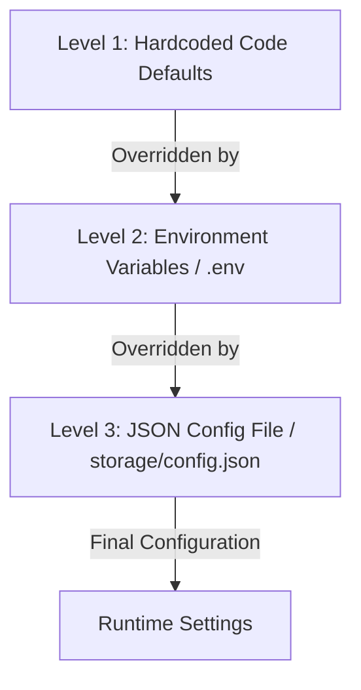

# TalkDeskly Configuration Reference & Architecture Flow

This document details the configuration lifecycle of TalkDeskly, illustrating how configurations are resolved between frontend and backend components, and provides detailed templates of configuration files.

---

## 🔄 Configuration Loading Flow

TalkDeskly resolves configuration options at startup using a hierarchical priority model (levels 1 to 3). Higher-level sources override lower-level values:



1. **Level 1: Defaults (Lowest Priority)**: Defined internally within `backend/config/config.go` (e.g. default port is `8080`, default language is `en`).
2. **Level 2: Environment Variables**: Loaded from the system env or parsed from a local `.env` file at startup using `godotenv`.
3. **Level 3: JSON Config File (Highest Priority)**: Loaded from `storage/config.json`. If this file exists, non-nil values will override variables loaded from both Level 1 and Level 2.

---

## 📂 Backend Configuration Files

### 1. The Environment File (`.env`)
Place this file in the `backend/` directory during development, or in the same folder as the `talkdeskly` executable in production VM deployments.

```ini
# ==============================================================================
# TalkDeskly Server Environment Configuration
# ==============================================================================

# Server Network Settings
PORT=8080
BASE_URL=https://chat.yourdomain.com
GO_ENV=production
LOG_LEVEL=info

# JWT Authenticator Key (Generate a secure cryptokey for production)
JWT_SECRET=f3b55c5e8de95821c97a5b399203a3d5e2e8b28cf9b3f4621cba1b9d4a8e2689

# Database Connections (PostgreSQL and Redis)
DATABASE_URL=postgres://talkdeskly_user:secure_password@db_server_ip:5432/talkdeskly_db
REDIS_URL=redis://:redis_password@cache_server_ip:6379/0

# Internationalization Settings
DEFAULT_LANGUAGE=en
SUPPORTED_LANGUAGES=en,vi

# Email Gateway Settings (SMTP client configuration)
EMAIL_PROVIDER=smtp
EMAIL_HOST=smtp.mailgun.org
EMAIL_PORT=587
EMAIL_USERNAME=postmaster@yourdomain.com
EMAIL_PASSWORD=secure-smtp-password
EMAIL_FROM=support@yourdomain.com
```

---

### 2. The JSON Override File (`storage/config.json`)
If you require dynamically updating configurations (e.g. from an administrative portal UI) without modifying shell environments, use the `storage/config.json` file. 

```json
{
  "port": "9000",
  "base_url": "https://custom-chat.yourdomain.com",
  "environment": "production",
  "application_name": "TalkDeskly Custom Support",
  "enable_registration": "false",
  "default_language": "vi",
  "supported_languages": "en,vi"
}
```
*Note: Any settings configured in `storage/config.json` take ultimate precedence over environmental variables.*

---

## 🌐 Frontend Client Configuration Flow

Unlike the backend, the React frontend application uses **compile-time environment injection** in production and **runtime-mode checks** in development:

```
                  +----------------------------------+
                  |  Frontend Configuration Request  |
                  +----------------+-----------------+
                                   |
                  Is App running in Development Mode?
                                   |
                  +----------------+----------------+
                  |                                 |
               [ YES ]                           [ NO ]
                  |                                 |
                  v                                 v
      [ Hardcoded Local Dev ]             [ Production Relative ]
      - Base URL: http://localhost:6721   - Base URL: /api
      - WS URL: ws://localhost:6721       - WS URL: /ws
```

### Development Mode (Local Host)
In development mode, the client applications automatically query the Go server running on port `6721`.
- **API Requests**: `http://localhost:6721/api`
- **WebSockets (Real-time)**: `ws://localhost:6721/ws`

### Production Mode (Built Package)
When the React dashboard and chat-widget are built using `npm run build`, they use **relative pathing**:
- **API Requests**: `/api` (resolves relatively back to the host serving the index page, e.g. `https://chat.yourdomain.com/api`).
- **WebSockets (Real-time)**: `/ws` (resolves to `wss://chat.yourdomain.com/ws`).
This avoids hardcoding domains inside client builds, making the output packages portable across different subdomains.

---

## ⚙️ Configuration Properties Reference

| Environmental Key | JSON Field Name | Default Value | Description |
| :--- | :--- | :--- | :--- |
| `PORT` | `port` | `8080` | Network port the HTTP/WebSocket server binds to. |
| `BASE_URL` | `base_url` | `http://localhost:8080` | Public base URL used for links and redirect parameters. |
| `GO_ENV` | `environment` | `development` | Active environment mode (`production` or `development`). |
| `LOG_LEVEL` | `log_level` | `debug` | Server log verbosity level (`debug`, `info`, `warn`, `error`). |
| `JWT_SECRET` | `jwt_secret` | `secret` | Cryptographic secret for signing tokens. **Must override in production!** |
| `DATABASE_URL` | `database_dsn` | `postgres://...` | DSN connection string for the PostgreSQL database. |
| `REDIS_URL` | `redis_addr` | `redis:6379` | Host address of the Redis instance. |
| `DEFAULT_LANGUAGE`| `default_language` | `en` | Default fallback UI language. |
| `SUPPORTED_LANGUAGES`| `supported_languages` | `en` | Comma-separated list of enabled languages. |
| `EMAIL_PROVIDER` | `email_provider` | `smtp` | Mailer client type (`smtp` or `gomail`). |
| `EMAIL_HOST` | `email_host` | `mailhog` | SMTP host gateway. |
| `EMAIL_PORT` | `email_port` | `1025` | SMTP network port. |
| `EMAIL_USERNAME` | `email_username` | *(empty)* | Authenticated email address username. |
| `EMAIL_PASSWORD` | `email_password` | *(empty)* | Authenticated email address password. |
| `EMAIL_FROM` | `email_from` | `noreply@...` | From address header for outbound emails. |
