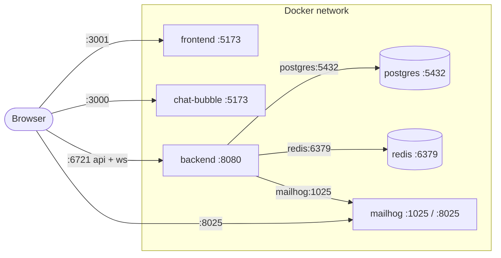

# TalkDeskly Development Deployment

This guide explains how to build and run TalkDeskly in development mode with Docker Compose.

The deployment package in this folder contains:

| File | Purpose |
| --- | --- |
| `development-deployment.md` | Step-by-step development deployment guide |

## Table Of Contents

- [1. What Development Mode Runs](#1-what-development-mode-runs)
  - [Development Architecture](#development-architecture)
    - [Development Communication Checks](#development-communication-checks)
- [2. Docker Compose Development Build](#2-docker-compose-development-build)
- [3. Source Mounts And Hot Reload](#3-source-mounts-and-hot-reload)
- [4. Prerequisites](#4-prerequisites)
- [5. Published Ports](#5-published-ports)
  - [Backend Port Convention](#backend-port-convention)
  - [Why The 6721 Alias Exists](#why-the-6721-alias-exists)
- [6. Runtime Variables](#6-runtime-variables)
  - [Config Name Warning](#config-name-warning)
  - [Frontend API URL Warning](#frontend-api-url-warning)
- [7. SMTP Host Rule](#7-smtp-host-rule)
- [8. Step-By-Step Deploy](#8-step-by-step-deploy)
  - [Step 0: Verify Prerequisites](#step-0-verify-prerequisites)
  - [Step 1: Build Development Images](#step-1-build-development-images)
  - [Step 2: Start The Development Stack](#step-2-start-the-development-stack)
  - [Step 3: Watch Startup Logs](#step-3-watch-startup-logs)
  - [Step 4: Check Containers](#step-4-check-containers)
  - [Step 5: Verify HTTP Routes](#step-5-verify-http-routes)
  - [Step 6: Seed Demo Data](#step-6-seed-demo-data)
  - [Step 7: Test Backend CLI Commands](#step-7-test-backend-cli-commands)
  - [Step 8: Test Email Delivery](#step-8-test-email-delivery)
- [9. Backend Hot Reload And Debugging](#9-backend-hot-reload-and-debugging)
- [10. Development Data And Volumes](#10-development-data-and-volumes)
- [11. Development Widget Behavior](#11-development-widget-behavior)
  - [Widget URL Model](#widget-url-model)
  - [Test Any Inbox In Chat-Bubble Dev Mode](#test-any-inbox-in-chat-bubble-dev-mode)
  - [Find A Test Inbox ID](#find-a-test-inbox-id)
  - [Verify The Selected Inbox](#verify-the-selected-inbox)
  - [End-To-End Widget Test](#end-to-end-widget-test)
  - [Reset Browser Widget State](#reset-browser-widget-state)
- [12. Running Individual Services](#12-running-individual-services)
- [13. What The Development Dockerfiles Do](#13-what-the-development-dockerfiles-do)
  - [Backend Dockerfile](#backend-dockerfile)
  - [Frontend Dockerfile](#frontend-dockerfile)
  - [Chat-Bubble Dockerfile](#chat-bubble-dockerfile)
- [14. Database Initialization](#14-database-initialization)
- [15. Troubleshooting](#15-troubleshooting)
  - [Backend Keeps Restarting](#backend-keeps-restarting)
  - [Frontend Loads But API Calls Fail](#frontend-loads-but-api-calls-fail)
  - [Chat-Bubble Stays On Connecting](#chat-bubble-stays-on-connecting)
  - [Frontend Or Chat-Bubble Container Exits](#frontend-or-chat-bubble-container-exits)
  - [MailHog Is Empty](#mailhog-is-empty)
  - [Database Port Conflict](#database-port-conflict)
  - [Dev Data Looks Stale](#dev-data-looks-stale)
- [16. Stop Development Stack](#16-stop-development-stack)
- [17. Copy-Paste Quick Start](#17-copy-paste-quick-start)

## 1. What Development Mode Runs

Development mode runs the backend, admin frontend, chat widget, database, Redis, and a local SMTP test server as separate containers.

The development stack runs:

| Service | Purpose |
| --- | --- |
| `backend` | Go/Fiber backend, REST API, WebSocket routes, CLI commands, hot reload through Air |
| `frontend` | Vite development server for the admin/agent frontend |
| `chat-bubble` | Vite development server for the embeddable chat widget SDK app |
| `postgres` | PostgreSQL database for local development data |
| `redis` | Redis for background jobs and realtime support |
| `mailhog` | Local SMTP capture server and web inbox for email testing |

Development mode differs from production mode in these important ways:

| Area | Development mode | Production mode |
| --- | --- | --- |
| Frontend delivery | Separate Vite container | Static files served by backend |
| Chat widget delivery | Separate Vite container | Built SDK served from backend `/sdk/sdk.iife.js` |
| Backend runtime | Source mounted into container and rebuilt by Air | Compiled binary inside production image |
| Email delivery | MailHog test SMTP service | SMTP provider from runtime configuration |
| Restart policy | No explicit restart policy | `unless-stopped` for runtime services |

Development mode is for local feature work, debugging, and integration testing. Do not use it for a real production deployment.

### Development Architecture

Who talks to whom in development mode:



Browser edges are published host ports; backend edges are Compose service names inside the Docker network.

Every connection in development mode:

| From | To | Address used | Protocol | Purpose |
| --- | --- | --- | --- | --- |
| Browser | `frontend` container | `http://localhost:3001` | HTTP | Load the admin app (Vite dev server) |
| Browser | `chat-bubble` container | `http://localhost:3000` | HTTP | Load the widget dev page (Vite dev server) |
| Browser | `backend` container | `http://localhost:6721/api` | HTTP | REST calls made by admin app JS and widget JS |
| Browser | `backend` container | `ws://localhost:6721/ws` | WebSocket | Realtime events for agents and widget visitors. Widget config still uses HTTP `baseUrl`; the SDK derives the WebSocket route from it. |
| Browser | `mailhog` container | `http://localhost:8025` | HTTP | Read captured emails |
| `backend` container | `postgres` container | `postgres:5432` | TCP | Database, via Compose service name |
| `backend` container | `redis` container | `redis:6379` | TCP | Background jobs and realtime support |
| `backend` container | `mailhog` container | `mailhog:1025` | SMTP | Outgoing email capture |
| Host tools (optional) | `postgres` container | `localhost:5433` | TCP | Inspect the database from the host |

Two rules that explain the whole picture:

1. The `frontend` and `chat-bubble` containers never call the backend. They only serve JavaScript. Every API and WebSocket call originates from the browser, which lives on the host, outside the Docker network. That is why the browser-facing addresses use `localhost` plus a published host port (`6721` maps to backend container port `8080`), while container-to-container addresses use Compose service names plus container ports.
2. Never mix the two address planes. `postgres:5432` works only from inside the Docker network; `localhost:6721` works only from the host and the browser.

#### Development Communication Checks

| Check | Expected result |
| --- | --- |
| `docker compose -f docker-compose.dev.yml ps` | Backend publishes both `8080:8080` and `6721:8080` |
| `curl http://localhost:6721/health` | Browser-facing backend alias works |
| `curl http://localhost:6721/api/public/inbox/<inbox-id>` | Widget public inbox REST path works |
| Browser devtools on `http://localhost:3000` | Widget REST uses `http://localhost:6721/api`; contact WebSocket uses the same backend origin plus `/ws` |
| Backend logs | No `record not found` for the widget inbox ID; `conversation_start` appears after starting a chat |

## 2. Docker Compose Development Build

`docker-compose.dev.yml` builds three local development images:

```yaml
services:
  backend:
    build:
      context: ./backend
      dockerfile: docker/Dockerfile.dev
  frontend:
    build:
      context: ./frontend
      dockerfile: docker/Dockerfile.dev
  chat-bubble:
    build:
      context: ./chat-bubble
      dockerfile: docker/Dockerfile.dev
```

The build contexts are intentionally scoped to each application folder.

| Image | Build context | Dockerfile | Runtime command |
| --- | --- | --- | --- |
| Backend dev image | `./backend` | `backend/docker/Dockerfile.dev` | `air` |
| Frontend dev image | `./frontend` | `frontend/docker/Dockerfile.dev` | `npm run dev -- --host` |
| Chat widget dev image | `./chat-bubble` | `chat-bubble/docker/Dockerfile.dev` | `npm run dev -- --host` |

The backend image installs Go build dependencies and Air. The frontend and chat widget images install npm dependencies and run Vite in host-accessible mode.

## 3. Source Mounts And Hot Reload

Development Compose mounts source folders into each app container:

| Service | Host path | Container path | Effect |
| --- | --- | --- | --- |
| `backend` | `./backend` | `/app` | Go source changes are rebuilt by Air |
| `frontend` | `./frontend` | `/app` | Vite sees frontend source changes |
| `chat-bubble` | `./chat-bubble` | `/app` | Vite sees widget source changes |

The Node services also mount an anonymous `/app/node_modules` volume:

```yaml
volumes:
  - ./frontend:/app
  - /app/node_modules
```

This keeps container-installed dependencies from being overwritten by the host source bind mount.

## 4. Prerequisites

Install these tools on the development machine:

| Tool | Needed for |
| --- | --- |
| Docker + Docker Compose | Build and run the full development stack |
| Git | Clone and update the repository |
| curl or browser | Verify HTTP routes |
| Go | Optional, only needed when running backend commands directly on the host |
| Node.js + npm | Optional, only needed when running frontend or chat-bubble directly on the host |

On Windows PowerShell, use `npm.cmd` if `npm` is blocked by execution policy.

## 5. Published Ports

Development mode publishes these ports to the host:

| Host port | Container/service | Purpose |
| --- | --- | --- |
| `3000` | `chat-bubble:5173` | Chat widget Vite development server |
| `3001` | `frontend:5173` | Admin/agent frontend Vite development server |
| `8080` | `backend:8080` | Backend REST API and WebSocket server |
| `6721` | `backend:8080` | Compatibility alias for current frontend and chat-bubble development URLs |
| `2345` | `backend:2345` | Delve debugger endpoint configured by Air |
| `5433` | `postgres:5432` | PostgreSQL access from host tools |
| `6379` | `redis:6379` | Redis access from host tools |
| `1025` | `mailhog:1025` | Local SMTP endpoint |
| `8025` | `mailhog:8025` | MailHog web inbox |

If a port is already in use, edit the left side of the relevant mapping in `docker-compose.dev.yml`.

Example:

```yaml
ports:
  - "3002:5173"
```

The right side is the port inside the container and should usually stay unchanged.

### Backend Port Convention

In Compose development mode, the backend listens on the internal backend container port defined by `docker-compose.dev.yml`.

The repository also has `backend/.env` for non-Compose/local backend runs. That host-run port does not win inside the Compose backend container because Compose sets `PORT` as a container environment variable before the Go app calls `godotenv.Load()`.

The backend service therefore publishes two host ports:

```yaml
ports:
  - "8080:8080"
  - "6721:8080"
```

Use `8080` when testing the backend directly. Use `6721` for compatibility with the current frontend and chat widget development code, which hard-codes `http://localhost:6721/api` and `ws://localhost:6721/ws` in development mode.

### Why The 6721 Alias Exists

The alias is a deliberate compatibility fix for configuration drift between this Compose file and the client source code. The history, reconstructed from the git log:

| When | What happened |
| --- | --- |
| Initial commit (2025-04) | The project was developed host-run: `backend/.env` set `PORT=6721`, and the clients read `import.meta.env.VITE_API_URL \|\| "http://localhost:6721/api"`  -  environment variable first, `6721` as fallback |
| 2025-04-14 | `docker-compose.dev.yml` was added with container port `8080` (matching the production image convention) and `VITE_API_URL`/`VITE_WS_URL` pointing at `8080`, relying on the clients reading those variables |
| 2025-06-07 | A client refactor for production single-origin support changed the clients to `import.meta.env.DEV ? "http://localhost:6721/api" : "/api"`. This removed the `VITE_API_URL` lookup entirely and hard-coded `6721` for development |
| Result | The Compose file no longer matched the clients: browsers called `localhost:6721`, but Compose only published `8080`, so login and every API call failed in Docker development mode |
| 2026-07 | The host alias `6721:8080` was added so the hard-coded client URLs reach the backend again, without touching application code |

Why an alias instead of changing the backend container port to `6721`:

1. The browser is the caller, not the containers. The `frontend` and `chat-bubble` containers only serve JavaScript; every API and WebSocket call originates in the browser on the host, so what matters is which host port is published (see [Development Architecture](#development-architecture)).
2. Container port `8080` is kept for parity with the production image, which builds on `EXPOSE 8080`. The host-port mapping is the flexible layer in Docker; the container port is the stable convention.
3. `6721` remains the host-run convention from `backend/.env`, and the alias bridges that convention into Compose mode without a code change.

The root fix  -  restoring the `VITE_API_URL`/`VITE_WS_URL` lookup in the four client files  -  is described in [Frontend API URL Warning](#frontend-api-url-warning). Once that is done, the alias can be removed and development mode can publish `8080` only.

## 6. Runtime Variables

Development mode defines runtime variables directly in `docker-compose.dev.yml`.

Do not commit real secrets. If you need machine-specific overrides, prefer a local override file such as `docker-compose.override.yml` that is not committed.

Variable reference:

| Variable | Service | Required | Sensitivity | Purpose | Value |
| --- | --- | --- | --- | --- | --- |
| `NODE_ENV` | `frontend`, `chat-bubble` | yes | public config | Enables Node development behavior | `unspecified` |
| `VITE_API_URL` | `chat-bubble` | intended | public config | Intended API base URL for widget dev runtime | `unspecified` |
| `VITE_WS_URL` | `chat-bubble` | intended | public config | Intended WebSocket URL for widget dev runtime | `unspecified` |
| `GO_ENV` | `backend` | yes | public config | Marks backend runtime as development mode in Compose | `unspecified` |
| `DATABASE_URL` | `backend` | yes | secret/internal | Backend PostgreSQL connection string | `[redacted]` |
| `PORT` | `backend` | yes | public config | Backend listen port inside the container | `unspecified` |
| `JWT_SECRET` | `backend` | yes | secret | Local token signing secret | `[redacted]` |
| `BASE_URL` | `backend` | yes | public config | Backend base URL for generated links and widget integration | `unspecified` |
| `REDIS_URL` | `backend` | yes | internal config | Redis address used by backend services | `unspecified` |
| `EMAIL_HOST` | `backend` | yes | internal config | SMTP host reachable from backend container | `unspecified` |
| `EMAIL_PORT` | `backend` | yes | internal config | SMTP port reachable from backend container | `unspecified` |
| `EMAIL_USERNAME` | `backend` | optional | secret | SMTP username when the provider requires auth | `[redacted]` |
| `EMAIL_PASSWORD` | `backend` | optional | secret | SMTP password when the provider requires auth | `[redacted]` |
| `EMAIL_FROM` | `backend` | yes | public config | Sender address used by backend emails | `unspecified` |
| `POSTGRES_USER` | `postgres` | yes | internal config | Local database user | `unspecified` |
| `POSTGRES_PASSWORD` | `postgres` | yes | secret | Local database password | `[redacted]` |
| `POSTGRES_DB` | `postgres` | yes | internal config | Local database name | `unspecified` |
| `MH_STORAGE` | `mailhog` | yes | internal config | MailHog message storage mode | `unspecified` |
| `MH_MAILDIR_PATH` | `mailhog` | yes | internal config | MailHog storage directory inside container | `unspecified` |

### Config Name Warning

The backend config loader reads `ENVIRONMENT`, not `GO_ENV`.

`docker-compose.dev.yml` currently sets `GO_ENV`. That value may be useful for conventions or future code, but it does not populate `config.App.Environment` in the current backend config loader.

If backend behavior must depend on the environment name, set `ENVIRONMENT` as well.

### Frontend API URL Warning

The current frontend and chat-bubble source code hard-codes development API and WebSocket URLs in these files:

| File | Current behavior |
| --- | --- |
| `frontend/src/lib/api/client.ts` | Uses a hard-coded development API base URL |
| `frontend/src/context/websocket-context.tsx` | Uses a hard-coded development WebSocket URL |
| `chat-bubble/app/lib/api/client.ts` | Uses a hard-coded development API base URL |
| `chat-bubble/app/sdk.tsx` | Auto-initializes the widget in development with a hard-coded base URL |

Because of that, the `VITE_API_URL` and `VITE_WS_URL` values in `docker-compose.dev.yml` are not currently consumed by those clients.

The current Compose development stack handles this by publishing backend container port `8080` on host port `6721` as well:

```yaml
backend:
  ports:
    - "8080:8080"
    - "6721:8080"
```

That means these browser-visible URLs reach the same backend:

| URL | Use case |
| --- | --- |
| `http://localhost:8080` | Direct backend checks and documentation examples |
| `http://localhost:6721` | Current frontend and chat-bubble development clients |

If this compatibility alias is removed, then before relying on the Compose-published backend URL, either:

1. Update the frontend and widget clients to read `import.meta.env.VITE_API_URL` and `import.meta.env.VITE_WS_URL`.
2. Or align the backend host port with the hard-coded development URLs.

This is the main configuration mismatch to check if the frontend loads but API or WebSocket calls fail.

## 7. SMTP Host Rule

In Docker Compose, services should talk to each other by service name.

The backend should use the MailHog Compose service as its SMTP host. Do not use `localhost` unless the SMTP server runs inside the backend container itself.

From inside a Docker container, `localhost` means that same container.

Use this pattern:

| SMTP location | `EMAIL_HOST` pattern |
| --- | --- |
| MailHog in this Compose stack | service name |
| SMTP server on Docker Desktop host | `host.docker.internal` |
| External SMTP provider | provider hostname |

Open the MailHog web inbox after the stack is running:

```text
http://localhost:8025
```

## 8. Step-By-Step Deploy

Run these commands from the repository root unless stated otherwise.

### Step 0: Verify Prerequisites

Verify tool availability first:

```bash
docker --version
docker compose version
git --version
curl --version
```

Expected result: each command prints a version and exits without error.

Then confirm the required host ports are free: `3000`, `3001`, `8080`, `6721`, `2345`, `5433`, `6379`, `1025`, `8025`.

Linux/macOS:

```bash
for p in 3000 3001 8080 6721 2345 5433 6379 1025 8025; do lsof -iTCP:$p -sTCP:LISTEN; done
```

Windows PowerShell:

```powershell
Get-NetTCPConnection -State Listen | Where-Object { $_.LocalPort -in 3000,3001,8080,6721,2345,5433,6379,1025,8025 }
```

Expected result: no output means all ports are free. If a port is taken, stop the conflicting process or remap the host side of that port in `docker-compose.dev.yml` as described in [section 5](#5-published-ports). Do not remap `6721` unless you also update the hard-coded development URLs described in [Frontend API URL Warning](#frontend-api-url-warning).

No `.env` file is required for development mode. All runtime variables are defined inside `docker-compose.dev.yml`.

### Step 1: Build Development Images

```bash
docker compose -f docker-compose.dev.yml build
```

To rebuild only one service:

```bash
docker compose -f docker-compose.dev.yml build backend
docker compose -f docker-compose.dev.yml build frontend
docker compose -f docker-compose.dev.yml build chat-bubble
```

### Step 2: Start The Development Stack

```bash
docker compose -f docker-compose.dev.yml up -d
```

If source dependencies or Dockerfiles changed and you want Compose to rebuild before starting:

```bash
docker compose -f docker-compose.dev.yml up -d --build
```

### Step 3: Watch Startup Logs

```bash
docker compose -f docker-compose.dev.yml logs -f backend
```

In a second terminal, check the Vite services:

```bash
docker compose -f docker-compose.dev.yml logs -f frontend
docker compose -f docker-compose.dev.yml logs -f chat-bubble
```

Expected behavior:

| Service | Expected startup signal |
| --- | --- |
| `backend` | Air builds and starts the Go server |
| `frontend` | Vite reports a network-accessible dev server |
| `chat-bubble` | Vite reports a network-accessible dev server |
| `postgres` | Container is running and accepts database connections |
| `redis` | Container is running |
| `mailhog` | Healthcheck passes |

### Step 4: Check Containers

```bash
docker ps --filter "name=talkdeskly"
```

Expected result:

| Container | Expected status |
| --- | --- |
| `talkdeskly-backend-1` | `Up` and not restarting |
| `talkdeskly-frontend-1` | `Up` |
| `talkdeskly-chat-bubble-1` | `Up` |
| `talkdeskly-postgres-1` | `Up` |
| `talkdeskly-redis-1` | `Up` |
| `talkdeskly-mailhog-1` | `healthy` |

If Compose uses a different project name, the container prefix may differ.

### Step 5: Verify HTTP Routes

```bash
curl http://localhost:8080/health
curl http://localhost:6721/health
curl -I http://localhost:3001/
curl -I http://localhost:3000/
curl -I http://localhost:8025/
```

Expected result:

| URL | Expected result |
| --- | --- |
| `http://localhost:8080/health` | HTTP `200` with health JSON |
| `http://localhost:6721/health` | HTTP `200` with the same backend health JSON |
| `http://localhost:3001/` | HTTP `200`, admin frontend Vite app |
| `http://localhost:3000/` | HTTP `200`, chat widget Vite app |
| `http://localhost:8025/` | HTTP `200`, MailHog web UI |

Then open:

```text
http://localhost:3001
http://localhost:3000
http://localhost:8025
```

### Step 6: Seed Demo Data

For local testing only, seed demo data after the backend is running:

```bash
docker compose -f docker-compose.dev.yml exec backend go run . seed run
```

The seed command creates a demo admin account:

```text
Email: admin@talkdeskly.com
Password: password123
```

Use it to log in at the admin frontend:

```text
http://localhost:3001
```

The admin frontend currently sends development API requests to `http://localhost:6721/api`, so the backend `6721:8080` port mapping must be present for browser login to work in Compose development mode.

The seed command also creates sample companies, agents, inboxes, contacts, conversations, and messages.

### Step 7: Test Backend CLI Commands

The backend CLI can be run inside the development container with `go run .`.

```bash
docker compose -f docker-compose.dev.yml exec backend go run . --help
docker compose -f docker-compose.dev.yml exec backend go run . db status
docker compose -f docker-compose.dev.yml exec backend go run . seed run
```

Use these commands for development checks without building a host binary.

### Step 8: Test Email Delivery

Trigger a flow that sends email, such as invite or password reset, then open:

```text
http://localhost:8025
```

Expected result:

| Check | Expected result |
| --- | --- |
| Backend logs | No SMTP connection error |
| MailHog inbox | Captured email appears in web UI |
| Email links | Links point to the configured frontend URL or backend URL for the tested flow |

If emails do not appear, check `EMAIL_HOST`, `EMAIL_PORT`, backend logs, and whether the flow actually sends email.

## 9. Backend Hot Reload And Debugging

The backend development image runs Air:

```text
CMD ["air"]
```

Air reads:

```text
backend/.air.toml
```

The current Air config builds the backend when Go/template files change and exposes a Delve endpoint through the backend container port mapping:

```text
localhost:2345
```

Debugging notes:

| Item | Details |
| --- | --- |
| Source root | `backend/` mounted to `/app` |
| Build output | `backend/tmp/` inside the mounted source tree |
| Debug port | Host `2345` mapped to container `2345` |
| Rebuild trigger | Go, template, and HTML files configured in `.air.toml` |
| Build log | `backend/build-errors.log` when Air build errors occur |

If debugging does not attach, verify the backend logs and confirm that Air started the Delve command from `.air.toml`.

## 10. Development Data And Volumes

Compose defines persistent named volumes:

| Volume | Used by | Purpose |
| --- | --- | --- |
| `postgres_data` | `postgres` | Local database files |
| `redis_data` | `redis` | Redis persistence data |
| `mailhog_data` | `mailhog` | Captured email storage |

Stop containers while keeping data:

```bash
docker compose -f docker-compose.dev.yml down
```

Remove all development data:

```bash
docker compose -f docker-compose.dev.yml down -v
```

Only remove volumes when a local reset is intended.

## 11. Development Widget Behavior

In development mode, the chat widget is served by the `chat-bubble` Vite server:

```text
http://localhost:3000
```

The widget auto-initializes in development from `chat-bubble/app/sdk.tsx`.

### Widget URL Model

In `chat-bubble/app/sdk.tsx`, the development config uses a single `baseUrl` value.

That value must be an HTTP origin, not a WebSocket URL:

```tsx
baseUrl: "http://localhost:6721"
```

Do not set it to `ws://localhost:6721`.

The widget uses `baseUrl` for both REST and WebSocket setup:

```tsx
apiClient.defaults.baseURL = config.baseUrl + "/api";
wsService.connect(config.baseUrl + "/ws", contactId, config.inboxId);
```

With `baseUrl: "http://localhost:6721"`, the browser-visible endpoints are:

| Derived endpoint | Purpose |
| --- | --- |
| `http://localhost:6721/api` | REST API calls, including public inbox details |
| `http://localhost:6721/ws/contacts?...` | WebSocket connection created by the widget service |

If `baseUrl` is set to `ws://localhost:6721`, REST calls become invalid because Axios receives a URL like `ws://localhost:6721/api`. The widget can then open visually but stay stuck at `Connecting...`.

Why the value must be HTTP and not WS: `baseUrl` is an origin from which the widget derives both channels, and the two channels tolerate schemes differently:

| Channel | Derived URL | Scheme requirement |
| --- | --- | --- |
| REST | `baseUrl + "/api"` -> Axios | Only `http://`/`https://`. With a `ws://` origin every request fails immediately, because XHR/fetch rejects the scheme |
| WebSocket | `baseUrl + "/ws"` -> `new WebSocket(...)` in `chat-bubble/app/lib/services/websocket/connection-manager.ts` | Accepts `ws://`/`wss://`, and modern browsers also accept `http://`/`https://` and normalize them to `ws://`/`wss://` |

Two facts make the HTTP origin the correct choice:

1. A WebSocket connection starts life as a plain HTTP request: the browser sends `GET` with an `Upgrade: websocket` header, the server answers `101 Switching Protocols`, and the same TCP connection then carries the WebSocket traffic. Same host, same port, same Fiber server  -  there is no separate WebSocket port, so nothing about the origin needs to be `ws://`.
2. The failure is asymmetric. An HTTP origin serves both channels. A WS origin kills REST outright  -  and the widget needs REST first (public inbox details, contact and conversation creation) before it ever opens the socket, which is why the symptom is a permanent `Connecting...` state rather than a WebSocket error.

The committed development config in `chat-bubble/app/sdk.tsx` previously set `baseUrl: "ws://localhost:6721"`  -  exactly this failure mode  -  and was corrected to `http://localhost:6721`.

Compatibility note: relying on the browser to normalize `http://` inside the WebSocket constructor is a relatively recent spec behavior (Chrome 125+, Safari 17.4+, and equivalent Firefox releases). If older browsers must be supported, normalize the scheme inside `connection-manager.ts` before calling `new WebSocket(...)`.

This matches the production SDK intent in the codebase:

| File | Evidence |
| --- | --- |
| `frontend/src/components/protected/settings/inbox/edit/website/widget-customization.tsx` | Generated install script sets `baseUrl` to `window.location.origin` |
| `frontend/src/components/protected/settings/inbox/wizard/website/complete.tsx` | Wizard install script also sets `baseUrl` to `window.location.origin` |
| `docs/prod/sample.html` | Production sample passes `BASE_URL = "http://localhost:8080"` as `baseUrl` |
| `docs/prod/production-deployment.md` | Documents `baseUrl` as the public backend URL, not a WebSocket URL |
| `chat-bubble/app/stores/config-context.tsx` | Default SDK config uses `https://talkdeskly.com` as `baseUrl` |

So `baseUrl` should be treated as the public backend origin that serves REST, WebSocket routes, and SDK assets. It is not a dedicated WebSocket endpoint.

### Test Any Inbox In Chat-Bubble Dev Mode

The development widget does not currently let you choose an inbox from the browser UI. It auto-starts with hard-coded config in:

```text
chat-bubble/app/sdk.tsx
```

To test the widget against any web chat inbox:

1. Start the development stack.
2. Seed demo data or create a web chat inbox from the admin frontend.
3. Copy the target web chat inbox ID.
4. Open `chat-bubble/app/sdk.tsx`.
5. Replace the hard-coded `inboxId` in the `import.meta.env.DEV` block.
6. Set `baseUrl` to the backend HTTP origin reachable from the browser, usually `http://localhost:6721` in Compose development mode.
7. Save the file and let the `chat-bubble` Vite container reload.
8. Open or refresh the widget dev page at `http://localhost:3000`.
9. If the browser has stale widget state, clear local storage for `localhost:3000` and refresh.

The development block looks like this:

```tsx
if (import.meta.env.DEV) {
  init({
    inboxId: "<target-web-chat-inbox-id>",
    position: "bottom-right",
    primaryColor: "#dc0462",
    zIndex: 9999,
    baseUrl: "http://localhost:6721",
  });
}
```

Fields to change when testing a different inbox:

| Field | Required change | Notes |
| --- | --- | --- |
| `inboxId` | yes | Use the ID of the web chat inbox you want to test |
| `baseUrl` | often | Must be an HTTP origin reachable from the browser, not a `ws://` URL |
| `position` | optional | Use when checking widget placement |
| `primaryColor` | optional | Use when checking widget theme |
| `zIndex` | optional | Use when checking overlay behavior on a host page |

If the widget opens but cannot load inbox data or create conversations, check that the selected inbox exists, is a web chat inbox, and the hard-coded `baseUrl` matches the backend port being used by the current dev stack.

### Find A Test Inbox ID

You can get a web chat inbox ID from the admin frontend:

1. Open `http://localhost:3001`.
2. Log in with a seeded admin account.
3. Open the inbox settings or inbox list.
4. Choose an inbox with type `web_chat`.
5. Copy the inbox ID from the UI, URL, API response, or browser devtools.

You can also query Postgres from the Compose stack:

```bash
docker compose -f docker-compose.dev.yml exec postgres \
  psql -U postgres -d talkdeskly \
  -c "select id, name, type from inboxes where type = 'web_chat' and deleted_at is null order by created_at desc;"
```

Use one of those `id` values as `inboxId` in `chat-bubble/app/sdk.tsx`.

### Verify The Selected Inbox

Before debugging the widget UI, verify the backend can see the inbox:

```bash
curl http://localhost:6721/api/public/inbox/<inbox-id>
```

Expected result:

| Check | Expected result |
| --- | --- |
| HTTP status | `200` |
| Response data | Inbox details for the selected web chat inbox |
| Backend logs | No `record not found` for that inbox ID |

If this endpoint fails, the widget will not connect correctly. Pick an existing `web_chat` inbox ID or create one from the admin frontend.

### End-To-End Widget Test

After `inboxId` and `baseUrl` are correct:

1. Open `http://localhost:3000`.
2. Clear local storage for `localhost:3000` if you previously tested with a different inbox.
3. Refresh the page.
4. Click the chat bubble.
5. Confirm the welcome panel changes from `Connecting...` to an enabled `Start Conversation` button.
6. Click `Start Conversation`.
7. Confirm the chat window opens or a conversation is created.
8. Check backend logs for `conversation_start` and no `record not found`.

Backend log check:

```bash
docker compose -f docker-compose.dev.yml logs --tail=100 backend
```

Database check:

```bash
docker compose -f docker-compose.dev.yml exec postgres \
  psql -U postgres -d talkdeskly \
  -c "select id, inbox_id, contact_id, status, created_at from conversations order by created_at desc limit 5;"
```

Expected result:

| Check | Expected result |
| --- | --- |
| Widget welcome button | `Start Conversation`, enabled |
| Backend log | `conversation_start` after clicking the button |
| Database | New conversation row with the selected `inbox_id` |

### Reset Browser Widget State

The widget persists contact and conversation state in browser local storage. If you change `inboxId` or reuse the same browser after a broken run, clear this state before retesting.

In browser devtools console on `http://localhost:3000`:

```js
localStorage.removeItem("contact-storage");
localStorage.removeItem("chat-storage");
location.reload();
```

Or clear all local storage for `localhost:3000` from the browser application/storage panel.

For a realistic end-to-end test:

1. Start the full development stack.
2. Seed demo data.
3. Open the admin frontend.
4. Create or inspect a web chat inbox.
5. Put that inbox ID into the `import.meta.env.DEV` block in `chat-bubble/app/sdk.tsx`.
6. Keep `baseUrl` as an HTTP origin such as `http://localhost:6721`.
7. Confirm REST and WebSocket calls reach the backend.

Important: production widget testing is different. Production serves the built SDK from:

```text
/sdk/sdk.iife.js
```

Development mode does not build or copy the SDK into `backend/public/sdk`.

## 12. Running Individual Services

You can start only the dependencies and one app service when debugging a narrower issue.

Backend with dependencies:

```bash
docker compose -f docker-compose.dev.yml up -d postgres redis mailhog backend
```

Frontend with backend and dependencies:

```bash
docker compose -f docker-compose.dev.yml up -d postgres redis mailhog backend frontend
```

Chat widget with backend and dependencies:

```bash
docker compose -f docker-compose.dev.yml up -d postgres redis mailhog backend chat-bubble
```

Run one-off commands in a service container:

```bash
docker compose -f docker-compose.dev.yml exec backend sh
docker compose -f docker-compose.dev.yml exec frontend sh
docker compose -f docker-compose.dev.yml exec chat-bubble sh
```

## 13. What The Development Dockerfiles Do

### Backend Dockerfile

`backend/docker/Dockerfile.dev` uses `golang:1.24-alpine`.

It installs:

| Dependency | Purpose |
| --- | --- |
| `gcc`, `g++`, `musl-dev`, `libc-dev`, `build-base` | Build support for Go packages that need C/C++ tooling |
| `git` | Go module and tooling support |
| `pkgconfig`, `make` | Build tooling support |
| `github.com/cosmtrek/air` | Go hot reload runner |

It copies `go.mod` and `go.sum`, downloads modules, copies the rest of the backend source, and starts Air.

### Frontend Dockerfile

`frontend/docker/Dockerfile.dev` uses `node:20-alpine`.

It copies `package*.json`, installs dependencies, copies source, and starts Vite with `--host` so the app is reachable from outside the container.

### Chat-Bubble Dockerfile

`chat-bubble/docker/Dockerfile.dev` also uses `node:20-alpine`.

It follows the same development pattern as the frontend Dockerfile and starts the widget Vite server with `--host`.

## 14. Database Initialization

The backend connects to PostgreSQL and runs GORM `AutoMigrate` during startup.

Seed data is optional and should be used only for local demos or disposable development environments:

```bash
docker compose -f docker-compose.dev.yml exec backend go run . seed run
```

Seeded demo credentials:

```text
admin@talkdeskly.com / password123
```

To clear seeded data while preserving schema:

```bash
docker compose -f docker-compose.dev.yml exec backend go run . seed clear --force
```

To reset the full local database volume:

```bash
docker compose -f docker-compose.dev.yml down -v
docker compose -f docker-compose.dev.yml up -d --build
```

## 15. Troubleshooting

### Backend Keeps Restarting

Check logs:

```bash
docker compose -f docker-compose.dev.yml logs --tail=100 backend
```

Common causes:

| Symptom | Likely cause | Fix |
| --- | --- | --- |
| Database connection failure | Postgres is not ready, DSN mismatch, or database volume has stale state | Check `postgres` logs, backend `DATABASE_URL`, and reset dev volumes if needed |
| Redis connection failure | Redis is not running or backend points to the wrong host | Check `redis` container status and backend `REDIS_URL` |
| SMTP connection refused | Backend cannot reach MailHog | Use the MailHog service name from inside Compose and check `mailhog` health |
| Air build error | Go code does not compile | Check `backend/build-errors.log` and backend logs |
| Debugger port unavailable | Host port is already used | Change the host side of the `2345:2345` mapping |

### Frontend Loads But API Calls Fail

Check browser devtools and compare the requested API URL with the backend port exposed by Compose.

The current source hard-codes development API and WebSocket URLs. If the browser requests a different port than Compose publishes, either update the source to use Vite environment variables or align the Compose port mapping.

For the current development stack, browser API calls to `http://localhost:6721/api` should work because `docker-compose.dev.yml` maps host `6721` to backend container `8080`.

Relevant files:

| File | Check |
| --- | --- |
| `frontend/src/lib/api/client.ts` | Admin frontend API base URL |
| `frontend/src/context/websocket-context.tsx` | Admin frontend WebSocket URL |
| `chat-bubble/app/lib/api/client.ts` | Widget API base URL |
| `chat-bubble/app/sdk.tsx` | Widget development auto-init base URL |

### Chat-Bubble Stays On Connecting

If the widget page loads but the opened chat window stays on `Connecting...`, check these items in order:

| Check | Command or location | Expected result |
| --- | --- | --- |
| Backend alias port | `curl http://localhost:6721/health` | HTTP `200` |
| Public inbox endpoint | `curl http://localhost:6721/api/public/inbox/<inbox-id>` | HTTP `200` |
| Widget `baseUrl` | `chat-bubble/app/sdk.tsx` | `http://localhost:6721`, not `ws://localhost:6721` |
| Widget `inboxId` | `chat-bubble/app/sdk.tsx` | Existing `web_chat` inbox ID |
| Backend logs | `docker compose -f docker-compose.dev.yml logs --tail=100 backend` | No `record not found` for the inbox ID |
| Browser storage | Devtools application/storage panel | Clear `contact-storage` and `chat-storage` after changing inboxes |

Typical causes:

| Symptom | Likely cause | Fix |
| --- | --- | --- |
| `record not found` in backend logs for an inbox ID | `sdk.tsx` points to a deleted or non-existent inbox | Replace `inboxId` with an existing `web_chat` inbox ID |
| Widget stays on `Connecting...` and REST calls do not appear valid | `baseUrl` starts with `ws://` | Set `baseUrl` to `http://localhost:6721` |
| Backend health works on `8080` but widget cannot connect | Host port `6721` is not published | Ensure `docker-compose.dev.yml` contains `6721:8080` and recreate backend |
| Widget still uses old contact/conversation after config changes | Browser local storage kept stale state | Clear `contact-storage` and `chat-storage`, then refresh |

### Frontend Or Chat-Bubble Container Exits

Check logs:

```bash
docker compose -f docker-compose.dev.yml logs --tail=100 frontend
docker compose -f docker-compose.dev.yml logs --tail=100 chat-bubble
```

Common causes:

| Symptom | Likely cause | Fix |
| --- | --- | --- |
| Dependency missing | Image was built before package changes | Rebuild the affected service |
| Vite cannot bind | Port conflict or command override issue | Check host port mapping and Vite logs |
| TypeScript/runtime error | App source error | Fix source and let Vite reload |

### MailHog Is Empty

Check:

1. The backend flow actually sends an email.
2. The backend points to the MailHog service from inside Compose.
3. MailHog is healthy.
4. Backend logs do not show SMTP errors.

### Database Port Conflict

The Postgres container maps the container database port to a host port for local tools.

If that host port is already used, change the left side of the mapping:

```yaml
ports:
  - "5434:5432"
```

Then connect host tools to the new host port. Other Compose services should continue using the Postgres service name and internal port.

### Dev Data Looks Stale

Stop containers and remove development volumes:

```bash
docker compose -f docker-compose.dev.yml down -v
docker compose -f docker-compose.dev.yml up -d --build
```

This deletes local Postgres, Redis, and MailHog data.

## 16. Stop Development Stack

Stop containers while keeping volumes:

```bash
docker compose -f docker-compose.dev.yml down
```

Stop and remove volumes for a disposable local reset:

```bash
docker compose -f docker-compose.dev.yml down -v
```

Do not remove volumes unless a data reset is explicitly intended.

## 17. Copy-Paste Quick Start

The full sequence from a clean checkout to a working development environment. Run [Step 0](#step-0-verify-prerequisites) first to confirm tools and free ports.

```bash
# Steps 1 and 2: build and start everything
docker compose -f docker-compose.dev.yml up -d --build

# Step 4: confirm all six containers are up
docker ps --filter "name=talkdeskly"

# Step 5: verify routes
curl http://localhost:8080/health
curl http://localhost:6721/health
curl -I http://localhost:3001/
curl -I http://localhost:3000/
curl -I http://localhost:8025/

# Step 6: seed demo data
docker compose -f docker-compose.dev.yml exec backend go run . seed run
```

Then open in the browser:

| URL | What to do |
| --- | --- |
| `http://localhost:3001` | Log in with `admin@talkdeskly.com` / `password123` |
| `http://localhost:3000` | Chat widget dev page; see [section 11](#11-development-widget-behavior) to point it at a real inbox |
| `http://localhost:8025` | MailHog inbox for captured emails |

On Windows PowerShell, replace `curl` with `curl.exe` so the real curl binary is used instead of the `Invoke-WebRequest` alias.
