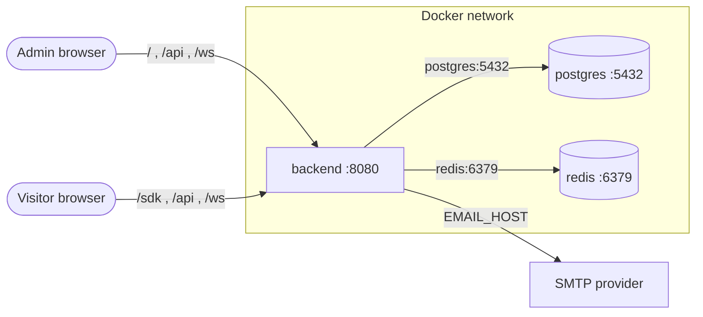

# TalkDeskly Production Deployment

This guide explains how to build and run TalkDeskly in production mode with Docker Compose.

The deployment package in this folder contains:

| File | Purpose |
| --- | --- |
| `production-deployment.md` | Step-by-step production deployment guide |
| `sample.html` | Standalone page for testing the embeddable chat widget |

## Table Of Contents

- [1. What Production Mode Runs](#1-what-production-mode-runs)
  - [Production Architecture](#production-architecture)
    - [Production Communication Checks](#production-communication-checks)
- [2. Docker Compose Production Build](#2-docker-compose-production-build)
- [3. Prerequisites](#3-prerequisites)
- [4. Runtime Variables](#4-runtime-variables)
- [5. SMTP Host Rule](#5-smtp-host-rule)
- [6. Step-By-Step Deploy](#6-step-by-step-deploy)
  - [Step 0: Verify Prerequisites And Configure Variables](#step-0-verify-prerequisites-and-configure-variables)
  - [Step 1: Build The Admin Frontend](#step-1-build-the-admin-frontend)
  - [Step 2: Copy Frontend Into Backend Public Directory](#step-2-copy-frontend-into-backend-public-directory)
  - [Step 3: Build The Chat Widget SDK](#step-3-build-the-chat-widget-sdk)
  - [Step 4: Copy SDK Into Backend Public Directory](#step-4-copy-sdk-into-backend-public-directory)
  - [Step 5: Build The Production Image](#step-5-build-the-production-image)
  - [Step 6: Start Production Stack](#step-6-start-production-stack)
  - [Step 7: Check Containers](#step-7-check-containers)
  - [Step 8: Verify HTTP Routes](#step-8-verify-http-routes)
  - [Step 9: Seed Demo Admin Account](#step-9-seed-demo-admin-account)
  - [Step 10: Test Widget With sample.html](#step-10-test-widget-with-samplehtml)
- [7. Backend CLI Build Script](#7-backend-cli-build-script)
- [8. What The Production Dockerfile Copies](#8-what-the-production-dockerfile-copies)
- [9. Widget Script Behavior](#9-widget-script-behavior)
- [10. Database Initialization](#10-database-initialization)
- [11. Troubleshooting](#11-troubleshooting)
  - [Backend Keeps Restarting](#backend-keeps-restarting)
  - [Frontend Container Is Missing](#frontend-container-is-missing)
  - [Chat-Bubble Container Is Missing](#chat-bubble-container-is-missing)
  - [Widget Does Not Load](#widget-does-not-load)
- [12. Stop Production Stack](#12-stop-production-stack)
- [13. Update And Redeploy](#13-update-and-redeploy)
- [14. Copy-Paste Command Summary](#14-copy-paste-command-summary)

## 1. What Production Mode Runs

Production mode does not run separate `frontend` or `chat-bubble` containers.

The production stack runs:

| Service | Purpose |
| --- | --- |
| `backend` | Go/Fiber backend, REST API, WebSocket routes, admin frontend static files, and widget SDK static files |
| `postgres` | PostgreSQL database |
| `redis` | Redis for background jobs and realtime support |

The backend serves:

| URL | Source inside image | Purpose |
| --- | --- | --- |
| `/` | `./public/app` | Admin/agent frontend |
| `/sdk/sdk.iife.js` | `./public/sdk` | Embeddable chat widget SDK |
| `/api/*` | Go backend routes | HTTP API |
| `/ws/*` | Go backend routes | WebSocket API |

### Production Architecture

Who talks to whom in production mode. `BASE_URL` is the public backend URL, for example `https://chat.example.com`, or `http://localhost:8080` for local production-mode testing:



Browser edges are routes under `BASE_URL`; backend edges are Compose service names, plus the external SMTP host.

Every connection in production mode:

| From | To | Address used | Protocol | Purpose |
| --- | --- | --- | --- | --- |
| Admin/agent browser | `backend` container | `BASE_URL/` | HTTP | Load the compiled admin app static files |
| Admin/agent browser | `backend` container | `BASE_URL/api` | HTTP | REST calls made by the admin app JS |
| Admin/agent browser | `backend` container | `BASE_URL/ws` | WebSocket | Realtime agent events. `BASE_URL` remains an HTTP/HTTPS origin; the browser performs the WebSocket upgrade on `/ws`. |
| Visitor browser | `backend` container | `BASE_URL/sdk/sdk.iife.js` | HTTP | Load the widget SDK from any embedding website |
| Visitor browser | `backend` container | `BASE_URL/api` and `BASE_URL/ws` | HTTP + WebSocket | Widget conversations and realtime messages. The install script passes one HTTP/HTTPS `baseUrl`; the SDK derives REST and WebSocket routes from it. |
| `backend` container | `postgres` container | `postgres:5432` | TCP | Database, via Compose service name |
| `backend` container | `redis` container | `redis:6379` | TCP | Background jobs and realtime support |
| `backend` container | SMTP provider | `EMAIL_HOST:EMAIL_PORT` | SMTP | Outgoing email (invites, resets, notifications) |

Two rules that explain the whole picture:

1. Production is a single-origin design: one backend container serves the admin app, the widget SDK, the REST API, and the WebSocket routes from the same `BASE_URL`. There are no frontend or chat-bubble containers, and no cross-origin configuration is needed for the admin app.
2. Browsers always connect through the published host port (`8080`) or whatever reverse proxy fronts it; only the backend uses the internal Docker network, addressing `postgres` and `redis` by service name.

#### Production Communication Checks

| Check | Expected result |
| --- | --- |
| `curl <public-backend-url>/health` | Backend health responds through the public entrypoint |
| `curl -I <public-backend-url>/` | Admin app static entrypoint responds |
| `curl -I <public-backend-url>/sdk/sdk.iife.js` | Widget SDK asset responds |
| Browser devtools on admin app | REST and WebSocket calls stay under the same public backend origin |
| Browser devtools on embedded widget | SDK, REST, and WebSocket all use the same `BASE_URL` |
| Backend logs | No database, Redis, or SMTP connection errors |

Reverse proxy note: if a load balancer or reverse proxy sits in front of the backend, it must forward normal HTTP routes and WebSocket upgrade requests for `/ws/*` to the backend container. It must also preserve the public origin used as `BASE_URL`; mixed HTTP/HTTPS origins will break the widget in browsers.

## 2. Docker Compose Production Build

`docker-compose.prod.yml` builds the backend image from local source:

```yaml
services:
  backend:
    build:
      context: ./backend
      dockerfile: docker/Dockerfile.prod
    image: talkdeskly:prod
```

Important: the Docker build context is `./backend`, not the repository root.

That means the Docker image can only copy files that exist under `backend/`. Before building the image, the frontend and chat widget SDK must be copied into:

```text
backend/public/app
backend/public/sdk
```

## 3. Prerequisites

Install these tools on the deployment machine:

| Tool | Needed for |
| --- | --- |
| Docker + Docker Compose | Build and run production containers |
| Node.js + npm | Build `frontend` and `chat-bubble` assets |
| Go | Optional, only needed when using `backend/build-cli.sh` directly on the host |

On Windows PowerShell, use `npm.cmd` if `npm` is blocked by execution policy.

## 4. Runtime Variables

Docker Compose reads variables from the shell or from a `.env` file in the repository root. Do not commit real secrets or shared environment files with real values.

For local production-mode testing, provide these variable names through your shell, local `.env`, or secret manager:

| Variable | Example placeholder |
| --- | --- |
| `POSTGRES_PASSWORD` | `[redacted]` |
| `JWT_SECRET` | `[redacted]` |
| `BASE_URL` | `<public-backend-url>` |
| `EMAIL_HOST` | `<smtp-host-reachable-from-backend-container>` |
| `EMAIL_PORT` | `<smtp-port>` |
| `EMAIL_USERNAME` | `[redacted-or-empty]` |
| `EMAIL_PASSWORD` | `[redacted-or-empty]` |
| `EMAIL_FROM` | `<sender-email>` |

Variable reference:

| Variable | Required | Sensitivity | Purpose |
| --- | --- | --- | --- |
| `POSTGRES_PASSWORD` | yes | secret | Password for the Compose-managed PostgreSQL instance |
| `JWT_SECRET` | yes | secret | Signing secret for auth tokens |
| `BASE_URL` | yes | public config | Public backend URL used by frontend and widget |
| `EMAIL_HOST` | yes | internal/public config | SMTP host reachable from backend container |
| `EMAIL_PORT` | yes | internal/public config | SMTP port |
| `EMAIL_USERNAME` | depends on SMTP provider | secret | SMTP username |
| `EMAIL_PASSWORD` | depends on SMTP provider | secret | SMTP password |
| `EMAIL_FROM` | yes | public config | Sender email address |

`docker-compose.prod.yml` also sets `EMAIL_PROVIDER=smtp` directly in the service definition. You do not need to provide it as a runtime variable.

## 5. SMTP Host Rule

Do not set `EMAIL_HOST` to `localhost` unless the SMTP server runs inside the backend container itself.

From inside a Docker container, `localhost` means that same container.

Use this instead:

| SMTP location | `EMAIL_HOST` pattern |
| --- | --- |
| Another Compose service | service name, for example `mailhog` or `smtp` |
| Host machine on Docker Desktop | `host.docker.internal` |
| External SMTP provider | provider hostname |

If this is wrong, backend may restart with:

```text
failed to connect to SMTP server
```

## 6. Step-By-Step Deploy

Run these commands from the repository root unless stated otherwise.

Complete Step 0 through Step 8 in order. Step 9 and Step 10 are optional local verification steps.

### Step 0: Verify Prerequisites And Configure Variables

Verify tool availability first:

```bash
docker --version
docker compose version
node --version
npm --version
```

Expected result: each command prints a version and exits without error.

| Check | Requirement |
| --- | --- |
| Docker | Docker Engine with Compose v2 (`docker compose`, not the legacy `docker-compose`) |
| Node.js | 18.x or newer; 20.x recommended to match the development images |
| npm | Included with Node.js |

Then create a `.env` file in the repository root. Docker Compose reads it automatically when you run `build` and `up` from the repository root.

Linux/macOS/Git Bash:

```bash
cat > .env <<'EOF'
POSTGRES_PASSWORD=<strong-random-password>
JWT_SECRET=<long-random-string>
BASE_URL=<public-backend-url>
EMAIL_HOST=<smtp-host-reachable-from-backend-container>
EMAIL_PORT=<smtp-port>
EMAIL_USERNAME=<smtp-username-or-empty>
EMAIL_PASSWORD=<smtp-password-or-empty>
EMAIL_FROM=<sender-email-address>
EOF
```

Windows PowerShell:

```powershell
@'
POSTGRES_PASSWORD=<strong-random-password>
JWT_SECRET=<long-random-string>
BASE_URL=<public-backend-url>
EMAIL_HOST=<smtp-host-reachable-from-backend-container>
EMAIL_PORT=<smtp-port>
EMAIL_USERNAME=<smtp-username-or-empty>
EMAIL_PASSWORD=<smtp-password-or-empty>
EMAIL_FROM=<sender-email-address>
'@ | Out-File -FilePath .env -Encoding ascii
```

Replace every `<placeholder>` before continuing:

| Placeholder | How to fill it |
| --- | --- |
| `<strong-random-password>` | Generate a random password, for example `openssl rand -hex 24` |
| `<long-random-string>` | Generate a random secret, for example `openssl rand -hex 32` |
| `<public-backend-url>` | Use the public backend origin. For local production-mode testing this is the backend host port; for a real deployment this is the HTTPS origin behind the reverse proxy |
| `<smtp-host-reachable-from-backend-container>` | Follow [section 5](#5-smtp-host-rule). Never `localhost` |
| `<smtp-port>` | Your SMTP provider port, commonly `587` or `465`; `1025` for a local MailHog |
| `<sender-email-address>` | Email address shown as the sender for backend email |

For local production-mode testing without a real SMTP provider, run a disposable MailHog on the host and point the backend at it:

```bash
docker run -d --name mailhog-local -p 1025:1025 -p 8025:8025 mailhog/mailhog
```

Then set the SMTP host to `host.docker.internal` and the SMTP port to the MailHog SMTP port (Docker Desktop on Windows/macOS), and read captured mail at `http://localhost:8025`.

Never commit `.env`. Verify it is ignored:

```bash
git check-ignore .env
```

Expected result: the command prints `.env`. If it prints nothing, add `.env` to `.gitignore` before continuing.

### Step 1: Build The Admin Frontend

Linux/macOS/Git Bash:

```bash
cd frontend
npm install
npm run build
cd ..
```

Windows PowerShell:

```powershell
Set-Location frontend
npm.cmd install
npm.cmd run build
Set-Location ..
```

Expected output:

```text
frontend/dist/index.html
frontend/dist/assets/
```

### Step 2: Copy Frontend Into Backend Public Directory

Linux/macOS/Git Bash:

```bash
mkdir -p backend/public/app
cp -R frontend/dist/* backend/public/app/
```

Windows PowerShell:

```powershell
New-Item -ItemType Directory -Force -Path backend\public\app | Out-Null
Copy-Item -Path frontend\dist\* -Destination backend\public\app -Recurse -Force
```

Expected output:

```text
backend/public/app/index.html
backend/public/app/assets/
```

### Step 3: Build The Chat Widget SDK

Linux/macOS/Git Bash:

```bash
cd chat-bubble
npm install
npm run build
cd ..
```

Windows PowerShell:

```powershell
Set-Location chat-bubble
npm.cmd install
npm.cmd run build
Set-Location ..
```

Expected output:

```text
chat-bubble/dist/sdk.iife.js
```

### Step 4: Copy SDK Into Backend Public Directory

Linux/macOS/Git Bash:

```bash
mkdir -p backend/public/sdk
cp -R chat-bubble/dist/* backend/public/sdk/
```

Windows PowerShell:

```powershell
New-Item -ItemType Directory -Force -Path backend\public\sdk | Out-Null
Copy-Item -Path chat-bubble\dist\* -Destination backend\public\sdk -Recurse -Force
```

Expected output:

```text
backend/public/sdk/sdk.iife.js
```

### Step 5: Build The Production Image

```bash
docker compose -f docker-compose.prod.yml build backend
```

Equivalent direct Docker command:

```bash
docker build -f backend/docker/Dockerfile.prod -t talkdeskly:prod backend
```

The Compose command is preferred because it uses the same image tag as `docker-compose.prod.yml`.

### Step 6: Start Production Stack

```bash
docker compose -f docker-compose.prod.yml up -d
```

If source files changed and you want Compose to rebuild before starting:

```bash
docker compose -f docker-compose.prod.yml up -d --build
```

### Step 7: Check Containers

```bash
docker ps --filter "name=talkdeskly"
```

Expected result:

| Container | Expected status |
| --- | --- |
| `talkdeskly-postgres-1` | `healthy` |
| `talkdeskly-redis-1` | `healthy` or `Up` |
| `talkdeskly-backend-1` | `Up` and not restarting |

### Step 8: Verify HTTP Routes

```bash
curl http://localhost:8080/health
curl -I http://localhost:8080/
curl -I http://localhost:8080/sdk/sdk.iife.js
```

Expected result:

| URL | Expected result |
| --- | --- |
| `/health` | HTTP `200` with health JSON |
| `/` | HTTP `200`, admin frontend static app |
| `/sdk/sdk.iife.js` | HTTP `200`, JavaScript SDK |

Then open the admin app:

```text
http://localhost:8080
```

### Step 9: Seed Demo Admin Account

For local testing only, seed demo data after the backend is running:

```bash
docker compose -f docker-compose.prod.yml exec backend ./talkdeskly seed run
```

The seed command creates a demo admin account:

```text
Email: admin@talkdeskly.com
Password: password123
```

Use it to log in at:

```text
http://localhost:8080
```

Do not use seeded demo credentials for a real production deployment.

### Step 10: Test Widget With `sample.html`

Open:

```text
docs/prod/sample.html
```

Or serve this deploy folder over HTTP:

```bash
cd docs/prod
python -m http.server 9000
```

Then open:

```text
http://localhost:9000/sample.html
```

The sample loads:

```text
http://localhost:8080/sdk/sdk.iife.js
```

If the SDK loads but the widget does not appear, edit `sample.html` and update:

| Field | Meaning |
| --- | --- |
| `BASE_URL` | Backend URL reachable from the browser |
| `inboxId` | Existing web chat inbox ID |

## 7. Backend CLI Build Script

The backend has a helper script:

```text
backend/build-cli.sh
```

It builds the TalkDeskly CLI binary on the host machine:

```bash
cd backend
./build-cli.sh
```

Internally, the script runs:

```bash
go build -o talkdeskly .
```

Expected output:

```text
backend/talkdeskly
```

Use this script only when you want to run backend CLI commands directly on the host, outside Docker.

Common CLI commands:

| Command | Purpose |
| --- | --- |
| `./talkdeskly --help` | Show CLI help |
| `./talkdeskly serve` | Start the backend server |
| `./talkdeskly migrate run` | Run migrations |
| `./talkdeskly seed run` | Seed demo data |
| `./talkdeskly db status` | Check database connectivity |
| `./talkdeskly config:show` | Print current configuration |
| `./talkdeskly release ...` | Run the release/build workflow |

Windows PowerShell equivalent:

```powershell
Set-Location backend
go build -o talkdeskly.exe .
```

For Docker production mode, `build-cli.sh` is usually not required. `backend/docker/Dockerfile.prod` already builds the backend binary and copies it into the runtime image.

Inside the running production container, use:

```bash
docker compose -f docker-compose.prod.yml exec backend ./talkdeskly --help
docker compose -f docker-compose.prod.yml exec backend ./talkdeskly seed run
docker compose -f docker-compose.prod.yml exec backend ./talkdeskly db status
```

## 8. What The Production Dockerfile Copies

`backend/docker/Dockerfile.prod` uses a Go builder stage, then copies the runtime files into a small Alpine image.

The final runtime image is expected to contain:

| Runtime image step | Source | Purpose |
| --- | --- | --- |
| install `ca-certificates` and `tzdata` | Alpine package manager | TLS certificates and timezone data |
| `WORKDIR /root/` | Dockerfile | Runtime working directory |
| `COPY /app/talkdeskly .` | builder stage | Go backend binary |
| `COPY /app/public ./public` | builder stage | Built frontend app and widget SDK |
| `COPY /app/templates ./templates` | builder stage | Email templates |
| `COPY /app/i18n ./i18n` | builder stage | Translation files |
| create `storage`, `logs`, `uploads` | Dockerfile | Runtime writable directories |
| `EXPOSE 8080` | Dockerfile | Backend HTTP port |
| `CMD ["./talkdeskly"]` | Dockerfile | Starts backend server |

This is why `backend/public/app` and `backend/public/sdk` must be prepared before image build.

## 9. Widget Script Behavior

The widget installation script is generated by the admin frontend component:

```text
frontend/src/components/protected/settings/inbox/edit/website/widget-customization.tsx
```

That component builds the script shown in the inbox settings UI.

Generated values:

| Script field | Source in frontend |
| --- | --- |
| `BASE_URL` | `window.location.origin` in the admin browser tab |
| `g.src` | `BASE_URL + "/sdk/sdk.iife.js"` |
| `inboxId` | `inbox.id` from `useEditInbox()` |
| `position` | `widgetPosition` from `useEditInbox()` |
| `primaryColor` | `widgetColor` from `useEditInbox()` |
| `baseUrl` | `window.location.origin` in the admin browser tab |

In production, the script must point to the public backend URL that serves both the admin app and `/sdk/sdk.iife.js`.

`baseUrl` is the same public backend origin used to load the SDK. It is not a WebSocket-only URL. The SDK derives:

| Derived URL | Purpose |
| --- | --- |
| `BASE_URL + "/sdk/sdk.iife.js"` | Load the widget SDK |
| `BASE_URL + "/api"` | REST calls for inbox details, contacts, and conversations |
| `BASE_URL + "/ws"` | WebSocket connection for realtime chat |

Example production script:

```html
<script>
(function(d, t) {
  var BASE_URL = "<public-backend-url>";
  var g = d.createElement(t);
  var s = d.getElementsByTagName(t)[0];
  g.src = BASE_URL + "/sdk/sdk.iife.js";
  g.defer = true;
  g.async = true;
  s.parentNode.insertBefore(g, s);
  g.onload = function() {
    window.talkDeskly.init({
      inboxId: "<web-chat-inbox-id>",
      position: "bottom-right",
      primaryColor: "#4f46e5",
      zIndex: 9999,
      baseUrl: BASE_URL
    });
  }
})(document, "script");
</script>
```

The hard-coded development `inboxId` in `chat-bubble/app/sdk.tsx` is guarded by `import.meta.env.DEV` and is not used by the production SDK build.

## 10. Database Initialization

The backend connects to Postgres and runs GORM `AutoMigrate` during startup.

Seed data is optional and should be used only for local demos or disposable test environments:

```bash
docker compose -f docker-compose.prod.yml exec backend ./talkdeskly seed run
```

Seeded demo credentials:

```text
admin@talkdeskly.com / password123
```

## 11. Troubleshooting

### Backend Keeps Restarting

Check logs:

```bash
docker compose -f docker-compose.prod.yml logs --tail=100 backend
```

Common causes:

| Symptom | Likely cause | Fix |
| --- | --- | --- |
| SMTP connection refused | `EMAIL_HOST` points to `localhost` from inside backend container | Use a Compose service name, `host.docker.internal`, or external SMTP host |
| Database connection failure | Postgres is not healthy or password/DSN mismatch | Check `POSTGRES_PASSWORD`, `DATABASE_URL`, and `postgres` health |
| Redis connection failure | Redis is not running or wrong host | Check `REDIS_URL` and `redis` container status |
| Frontend returns missing/blank content | `backend/public/app` was not prepared before image build | Rebuild frontend, copy assets, rebuild image |
| `/sdk/sdk.iife.js` returns `404` | `backend/public/sdk` was not prepared before image build | Rebuild chat-bubble, copy SDK, rebuild image |

### Frontend Container Is Missing

This is expected. Production serves frontend assets from the backend container.

### Chat-Bubble Container Is Missing

This is expected. Production serves the widget SDK from the backend container.

### Widget Does Not Load

Check:

1. `GET /sdk/sdk.iife.js` returns `200`.
2. The script `BASE_URL` is reachable from the visitor browser.
3. The `inboxId` exists.
4. The inbox is a web chat inbox.
5. Browser devtools has no API, WebSocket, CORS, or mixed-content errors.

## 12. Stop Production Stack

Stop containers while keeping volumes:

```bash
docker compose -f docker-compose.prod.yml down
```

Remove volumes only for disposable local testing:

```bash
docker compose -f docker-compose.prod.yml down -v
```

Do not remove production volumes unless a data reset is explicitly intended and backed up.

## 13. Update And Redeploy

When source code changes, repeat only the steps that cover the changed area, then rebuild and restart the backend:

| What changed | Required steps before rebuild |
| --- | --- |
| `frontend/` | Step 1 and Step 2 |
| `chat-bubble/` | Step 3 and Step 4 |
| `backend/` only | none, the image build compiles the backend |
| Documentation only | nothing to redeploy |

Rebuild and restart:

```bash
docker compose -f docker-compose.prod.yml build backend
docker compose -f docker-compose.prod.yml up -d
```

`up -d` replaces only the backend container with the new image. Postgres and Redis keep running and their volumes are preserved.

Verify after every redeploy:

```bash
curl http://localhost:8080/health
docker ps --filter "name=talkdeskly"
```

## 14. Copy-Paste Command Summary

The full sequence from a clean checkout to a running production stack. Complete [Step 0](#step-0-verify-prerequisites-and-configure-variables) first: the `.env` file must exist in the repository root before `build` and `up`.

Linux/macOS/Git Bash:

```bash
# Step 1: build admin frontend
cd frontend && npm install && npm run build && cd ..

# Step 2: copy frontend into backend
mkdir -p backend/public/app
cp -R frontend/dist/* backend/public/app/

# Step 3: build widget SDK
cd chat-bubble && npm install && npm run build && cd ..

# Step 4: copy SDK into backend
mkdir -p backend/public/sdk
cp -R chat-bubble/dist/* backend/public/sdk/

# Step 5: build production image
docker compose -f docker-compose.prod.yml build backend

# Step 6: start stack
docker compose -f docker-compose.prod.yml up -d

# Step 7 and Step 8: verify
docker ps --filter "name=talkdeskly"
curl http://localhost:8080/health
curl -I http://localhost:8080/
curl -I http://localhost:8080/sdk/sdk.iife.js

# Step 9 (optional, local testing only): seed demo data
docker compose -f docker-compose.prod.yml exec backend ./talkdeskly seed run
```

Windows PowerShell:

```powershell
# Step 1: build admin frontend
Set-Location frontend; npm.cmd install; npm.cmd run build; Set-Location ..

# Step 2: copy frontend into backend
New-Item -ItemType Directory -Force -Path backend\public\app | Out-Null
Copy-Item -Path frontend\dist\* -Destination backend\public\app -Recurse -Force

# Step 3: build widget SDK
Set-Location chat-bubble; npm.cmd install; npm.cmd run build; Set-Location ..

# Step 4: copy SDK into backend
New-Item -ItemType Directory -Force -Path backend\public\sdk | Out-Null
Copy-Item -Path chat-bubble\dist\* -Destination backend\public\sdk -Recurse -Force

# Step 5 and Step 6: build image and start stack
docker compose -f docker-compose.prod.yml build backend
docker compose -f docker-compose.prod.yml up -d

# Step 7 and Step 8: verify
docker ps --filter "name=talkdeskly"
curl.exe http://localhost:8080/health
curl.exe -I http://localhost:8080/
curl.exe -I http://localhost:8080/sdk/sdk.iife.js

# Step 9 (optional, local testing only): seed demo data
docker compose -f docker-compose.prod.yml exec backend ./talkdeskly seed run
```
